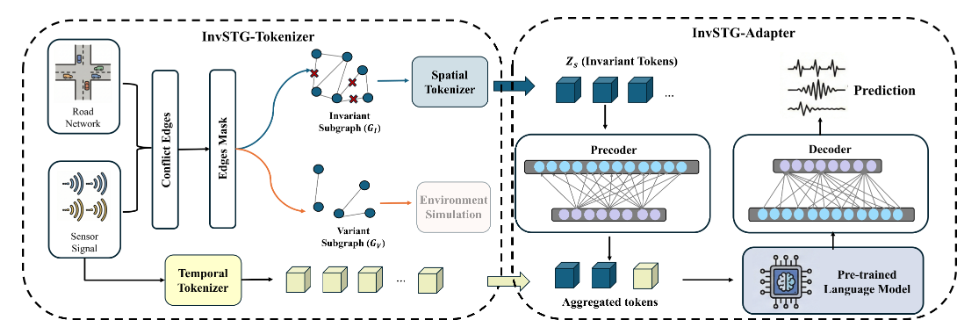

<h1 align="center">
Invariant Structure Learning with Pre-trained Language Models for Spatio-temporal Graph 🔥
</h1>



This is the official repository of our KDD 2026 paper. This paper propose an invariance-aware spatiotemporal graph learning framework that grounds PLMs in invariant structures named InvSTG-PLM. We formalize an invariance principle via token re-assignment, which simulates environments in the representation space, and design a variance-regularized objective which penalizes predictors relying on variant factors. Guided by this principle, we introduce a practical realization including the InvSTG-Tokenizer and InvSTG-Adapter, which goes beyond standard serialization by acting as an invariant filter. 
We implement extensive experiments on both standard and OOD settings, and results demonstrate that InvSTG-PLM achieves competitive performance in terms of both generalization and robustness.

## Table of Contents

- [Environment Setup](#environment-setup)
- [Data](#data)
- [Running Experiments](#running-experiments)

---

## Environment Setup

### 1. Create the conda environment

All commands below assume you are running from the repository root.

```bash
conda env create -f InvSTG-PLM/environment.yml
conda activate LLM-py3.9
```

### 2. Navigate to the source directory

All experiment scripts must be run from inside `src`:

```bash
cd InvSTG-PLM/InvSTG-PLM-main/src
```

### Platform notes

> **Linux (recommended):** This project is developed and tested on Linux. Using Linux is strongly recommended to avoid unexpected compatibility issues.

> **Windows:** The shell scripts require a Bash interpreter. You can obtain one in either of the following ways:
> - Install [Git for Windows](https://git-scm.com/download/win) (provides Git Bash), **or**
> - Add `git` to your conda environment:
>
> ```bash
> conda install -n LLM-py3.9 -c conda-forge git
> ```
>
> After installation, run the scripts from a Git Bash terminal, or from `cmd`/PowerShell after activating the conda environment that contains `git`.

---

## Data

We use the [PeMS0X](https://dot.ca.gov/programs/traffic-operations/mpr/pems-source) traffic datasets, which are collected by the Caltrans Performance Measurement System (PeMS). The raw traffic measurements are recorded every 30 seconds and aggregated into 5-minute intervals, resulting in tens of thousands of time steps for each dataset. The provided default command runs experiments on PeMS03; please use the corresponding script to evaluate another dataset. Extra experiments on [TrafficStream](https://github.com/AprLie/TrafficStream) and [KnowAir](https://github.com/shuowang-ai/PM2.5-GNN) can be seen in `InvSTG-PLM/InvSTG-PLM_TrafficStream` and `InvSTG-PLM/InvSTG-PLM-KnowAir` folders.

---

## Running Experiments

Run the following commands from `InvSTG-PLM/InvSTG-PLM-main/src`.

### Standard setting

```bash
bash ../scripts/pems03.sh
```

### Out-of-Distribution (OOD) setting

```bash
bash ../scripts/pems03_ood.sh
```
